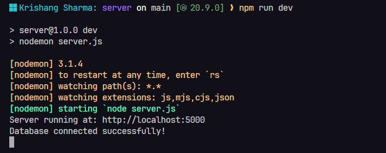

# Moni Matter(Server)

This is an all purpose expense tracking app that allows you to create groups, visualize your spending habits, curates articles for tips and advices and much more.

## Tech Stack

We are keeping it simple by using the MERN Stack, along with:

1. **multer**: For media uploads
2. **cloudinary**: For media management
3. **express-session**: For authentication and authorization
4. **bcrypt**: For password hashing and encyrption

_Dev Dependencies_

1. **morgan**: To log requests and status code in the terminal
2. **nodemon**: To restart the server after each change automatically

## Test it Yourself

To test the app on your local machine, follow the given steps:

### 1. Clone the repository

Go to the home page of the [repository](https://github.com/KrishangSharma/moni-matter-server) and download the `zip` files for the code.
.png>)

Or alternatively, open a terminal in your preferred directory and execute the following command:

`git clone https://github.com/KrishangSharma/moni-matter-server.git`

### 2. Install the packages

From the root directory, run `cd ./server` and then run `npm install` to install all the required dependencies.

### 3. Initialize Environment Variables

To get the app up and running, you need to set some environment variables first. These are:

1. **MONGO_URI**: For storing data to DB
2. **PORT**: The port where the server will run(optional)
3. **SESSION_SECRET**: A secret key that will be used by the session middleware
4. **CLOUD_NAME**: Cloudinary cloud name important for configuration
5. **CLOUDINARY_API_KEY**: API key for your cloudinary API
6. **CLOUDINARY_API_SECRET**: API secret provided by cloudinary

_Important_: Make sure to restart the server if you change any env variable(s).

### 4. Start the App

Head into the `server` directory and run `npm run dev`. If everything was setup correctly, you'll see something like this:

## Available Routes

**Important Notes**

#### 1. For user routes

- Every parameter needs to be passed in a `json` object.
- The routes that don't require any parameters, retrieve the userID from the current session itself.
- The login route can accept either an email or a phone number.

#### 2. For transaction routes

- When adding/updating a transaction, the data needs to be passed in as form-data to use the image for receipt.

#### 3. For group routes

- Wnen adding members to a group, the data will be sent as `json` object and the memberIDs will be in an array.

### 1. User Routes

URL: `http://localhost:${port}/user`

| Routes     | Method | isProtected | Params                                         | Response                                      |
| ---------- | ------ | ----------- | ---------------------------------------------- | --------------------------------------------- |
| 1. /       | GET    | Yes         | -                                              | Returns the current user object               |
| 2. /new    | POST   | No          | firstName, lastName, email, password, phoneNum | Returns the newly created user object         |
| 3. /login  | POST   | No          | phoneNum/email and password                    | Returns the user object that made the request |
| 4. /logout | POST   | Yes         | -                                              | Returns the logged out user object            |
| 5. /update | PATCH  | Yes         | updates                                        | Returns the updated user                      |
| 6. /delete | DELETE | Yes         | -                                              | Returns the deleted object for the user       |

### 2. Transaction Routes

URL: `http://localhost:${port}/transaction`

| Routes         | Method | isProtected | Params                                                     | Response                                     |
| -------------- | ------ | ----------- | ---------------------------------------------------------- | -------------------------------------------- |
| 1. /add        | POST   | Yes         | amount, category, description(optional), receipt(optional) | Returns the newly created transaction object |
| 2. /:id        | GET    | Yes         | transactionId                                              | Returns the requested transaction's object   |
| 3. /delete/:id | DELETE | Yes         | transactionId                                              | Returns the deleted transaaction             |
| 4. /update/:id | PATCH  | Yes         | amount, category, description(optional), receipt(optional) | Returns the updated transaction object       |

### 3. Group Routes

URL: `http://localhost:${port}/group`

| Routes          | Method | isProtected | Params               | Response                                                  |
| --------------- | ------ | ----------- | -------------------- | --------------------------------------------------------- |
| 1. /new         | POST   | Yes         | name, desc(optional) | Returns the newly created group's object                  |
| 2. /:id/members | POST   | Yes         | id, memberIDs(array) | Returns the group object with the members array populated |

#### Want to suggest changes? Have any extra ideas? Or if you want to collaborate, [just hit me up](https://krishangsharma.vercel.app/contact)!

### Stay tuned for further updates!
